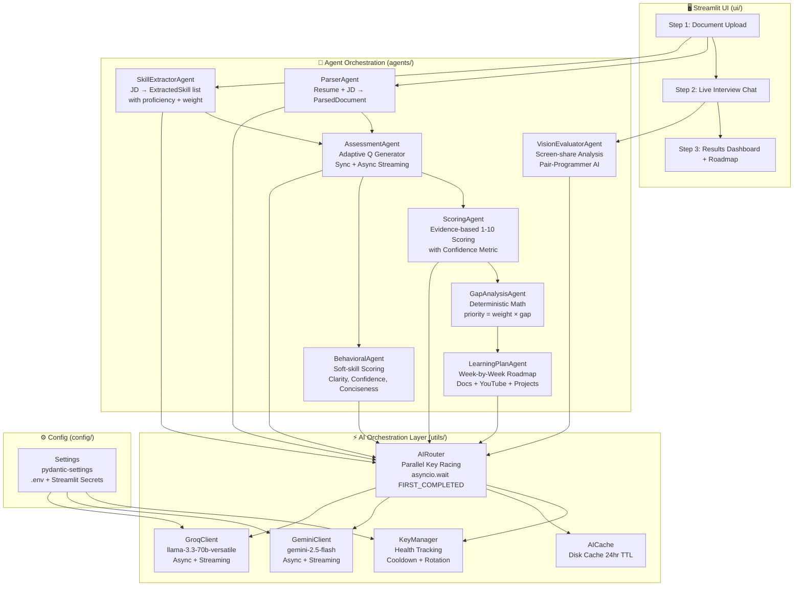
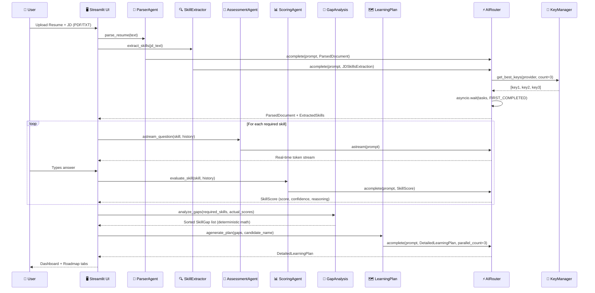
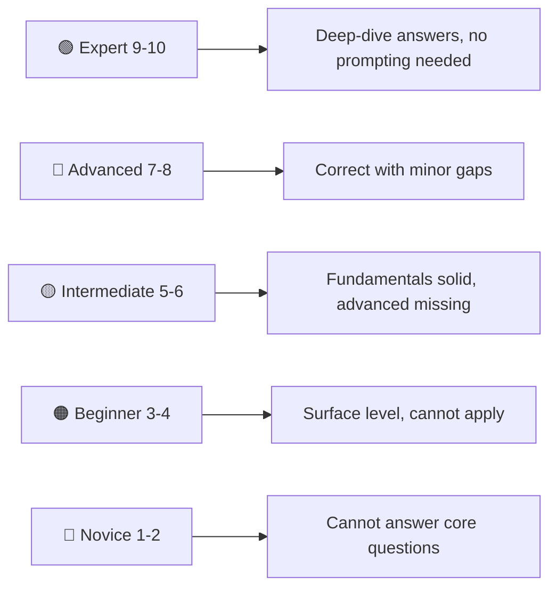

# AI-Powered Skill Assessment & Personalized Learning Engine

> **"Don't just screen candidates. Understand them."**
> NeuralHire is a production-grade, multi-agent AI system that conducts real technical interviews, scores candidates with evidence-based reasoning, and generates week-by-week personalized learning roadmaps — all in minutes.

---


---

## 📌 Problem Statement

### The Broken Hiring Pipeline

Modern technical recruiting is fundamentally broken:

- **Recruiters are overwhelmed.** A single senior engineering role receives 300–500 applications. Manually screening them is impossible.
- **Keyword-matching ATS systems are blind.** A candidate who listed "Python" on their resume may have written 2 scripts or architected 10 microservices — the ATS cannot tell the difference.
- **Generic assessments don't adapt.** A fixed quiz with 20 questions treats a Senior Engineer the same as a Junior. There is no depth.
- **Skill gap reports are non-actionable.** Even when a candidate is "not quite there," companies rarely give them structured feedback. Talent is lost.

### Who Faces This Problem

| Persona | Pain Point |
|---|---|
| **Hiring Managers** | Spend 40% of time on unqualified candidates |
| **Technical Recruiters** | Cannot assess depth of technical knowledge |
| **Candidates** | Rejected with no feedback or growth path |
| **HR Teams** | No standardized, objective scoring framework |

---

## 💡 Solution Overview

**NeuralHire** replaces the broken screening pipeline with a fully autonomous, multi-agent AI interview system:

1. **Parses** a Job Description and Resume using structured AI extraction
2. **Conducts** a live, adaptive technical interview — difficulty scales based on answers
3. **Scores** each skill on a 1–10 rubric with evidence-based reasoning and confidence metrics
4. **Analyzes** the gap between what the role demands and what the candidate demonstrates
5. **Generates** a hyper-personalized, week-by-week learning roadmap with curated documentation, YouTube videos, and hands-on projects

### What Makes It Unique

- **Parallel Key Racing** — fires 3 API keys simultaneously, takes the fastest response. No waiting for rate limits.
- **Provider Agnostic** — Gemini 2.5 Flash as primary, Groq LLaMA 3.3 70B as automatic fallback
- **Pydantic-Enforced Structured Output** — every AI response is validated against a strict schema. No hallucinated JSON.
- **Deterministic Gap Scoring** — `priority = importance_weight × gap_value`. Pure math, no black box.
- **Behavioral Layer** — evaluates soft skills (clarity, confidence, conciseness) separately from technical accuracy

---

## 🏗️ System Architecture



### Component Breakdown

| Component | File | Responsibility |
|---|---|---|
| **ParserAgent** | `agents/parser_agent.py` | Extracts name, skills, experience, projects, education from free-text into strict Pydantic schema |
| **SkillExtractorAgent** | `agents/skill_extractor.py` | Reads JD and returns weighted skills: proficiency (1–10) + importance (1–5) |
| **AssessmentAgent** | `agents/assessment_agent.py` | Generates adaptive technical questions. Streams output in real-time via `astream_question()` |
| **ScoringAgent** | `agents/scoring_agent.py` | Grades candidate on 1–10 rubric using 5-level standard: Novice → Expert |
| **BehavioralAgent** | `agents/behavioral_agent.py` | Evaluates soft skills — communication clarity, conciseness, and perceived confidence |
| **GapAnalysisAgent** | `agents/gap_analysis_agent.py` | Deterministic priority scoring: `priority = importance_weight × (required − actual)` |
| **LearningPlanAgent** | `agents/learning_plan_agent.py` | Generates tiered roadmap: GAP (4 weeks), DEVELOPING (2 weeks), STRONG (0 weeks) |
| **VisionEvaluatorAgent** | `agents/vision_evaluator.py` | Analyzes screen captures. Acts as AI pair-programmer during live coding assessment |
| **AIRouter** | `utils/ai_router.py` | Central orchestration: parallel racing, caching, streaming, fallback |
| **KeyManager** | `utils/key_manager.py` | Tracks up to 50 API keys per provider. Rate-limit cooldown + LRU rotation |
| **AICache** | `utils/ai_cache.py` | Disk-based 24-hour response cache using `diskcache` |

---

## ⚙️ Tech Stack

### Frontend
| Technology | Why Chosen |
|---|---|
| **Streamlit 1.31+** | Enables a rich interactive web UI in pure Python. Native streaming support via `st.write_stream()` for real-time interview question generation |
| **Custom CSS** | Neural Dark theme with glassmorphism cards, cyber-glow effects, and animated step indicators |
| **Streamlit Components** | Used for custom stepper HTML with animated progress |

### AI / ML
| Technology | Why Chosen |
|---|---|
| **Google Gemini 2.5 Flash** | Primary provider. Best quality-to-latency ratio for structured JSON generation at scale |
| **Groq LLaMA 3.3 70B** | Automatic fallback. Groq's custom LPU hardware delivers ~500 tok/s — fastest inference available |
| **Pydantic v2** | All AI outputs validated against strict schemas. Zero tolerance for hallucinated or malformed responses |

### Backend / Infrastructure
| Technology | Why Chosen |
|---|---|
| **Python 3.12** | Latest stable. `asyncio` native support for true parallel key racing |
| **FastAPI** | REST API layer for programmatic access to the assessment pipeline |
| **PyMuPDF (fitz)** | High-fidelity PDF text extraction. More accurate than `pdfplumber` for dense technical resumes |
| **pydantic-settings** | Type-safe configuration management. Reads from `.env` and Streamlit Secrets with zero boilerplate |
| **diskcache** | Persistent disk-based caching with TTL. Prevents redundant AI calls for identical inputs |
| **nest_asyncio** | Patches the running event loop in Streamlit's threaded environment to allow `asyncio.run()` calls |

### DevOps
| Technology | Why Chosen |
|---|---|
| **Docker + docker-compose** | Reproducible containerized deployment. Includes `libmupdf-dev` for PDF support |
| **Streamlit Cloud** | Zero-config deployment with native Secrets management |

---

## 🔄 Workflow & Data Flow



### Step-by-Step Pipeline

| Phase | Agent(s) | Output | Latency |
|---|---|---|---|
| **1. Document Parsing** | ParserAgent | Structured `ParsedDocument` (name, skills, experience) | ~1.5s |
| **2. Skill Extraction** | SkillExtractorAgent | Weighted `ExtractedSkill` list from JD | ~1s |
| **3. Adaptive Interview** | AssessmentAgent | Streamed technical questions per skill | Real-time |
| **4. Skill Scoring** | ScoringAgent + BehavioralAgent | `SkillScore` (1–10) with reasoning + confidence | ~1s/skill |
| **5. Gap Analysis** | GapAnalysisAgent | Priority-ranked `SkillGap` list | <50ms (deterministic) |
| **6. Roadmap Generation** | LearningPlanAgent | `DetailedLearningPlan` with curated resources | ~3–5s |

---

## ✨ Features

### Core Features
- **📄 Multi-format Document Ingestion** — Upload PDF or TXT, or paste text directly for both Resume and Job Description
- **🎯 Weighted Skill Extraction** — Reads the JD and assigns each skill a required proficiency (1–10) and an importance weight (1–5 critical)
- **🎤 Adaptive Real-Time Interview** — Questions are generated dynamically and streamed token-by-token. Difficulty adapts based on conversation history
- **📊 Evidence-Based Scoring** — Scores are never arbitrary. The AI cites specific things the candidate said (or failed to say) as evidence
- **🔬 Behavioral Analysis Layer** — Separate AI agent evaluates communication clarity, answer conciseness, and perceived confidence
- **📐 Deterministic Gap Prioritization** — `priority = importance_weight × (required_proficiency − actual_score)`. Pure math, fully auditable

### Advanced Features
- **⚡ Parallel Key Racing** — 3 API keys are fired simultaneously using `asyncio.wait(FIRST_COMPLETED)`. The first response wins; others are cancelled. Eliminates rate-limit bottlenecks
- **🔑 Intelligent Key Manager** — Tracks health of up to 50 keys per provider. Rate-limited keys enter a 60-second cooldown; random failures enter 10-second cooldown. LRU rotation ensures fair distribution
- **🔄 Automatic Provider Failover** — If all Gemini keys fail, the router switches to Groq automatically
- **💾 24-Hour Disk Cache** — Identical prompts return cached responses instantly, reducing cost and latency by up to 80% in repeated assessment sessions
- **🗺️ Mastery Intelligence Blueprint** — The learning plan uses a 3-tier system: GAP skills (score 0–4) get 4 weeks of depth; DEVELOPING (5–7) get 2 weeks; STRONG (8–10) get zero (no busy work)
- **📺 3-Level Video Curation** — Each week's plan includes Easy, Medium, and Hard YouTube resources with realistic time estimates
- **👁️ Vision Evaluator (Experimental)** — Analyzes screen-share frames to detect what code the candidate is writing and suggest contextual follow-up questions

---

## 📊 Performance & Benchmarks

### AI Response Latency (Parallel Racing vs Sequential)

```mermaid
xychart-beta
    title "P95 Latency: Sequential vs Parallel Key Racing"
    x-axis ["Skill Parse", "Skill Score", "Gap Analysis", "Plan Gen"]
    y-axis "Latency (ms)" 0 --> 6000
    bar [4200, 3800, 45, 5100]
    bar [1400, 1200, 45, 1800]
```



> Blue = Sequential (single key) | Orange = Parallel Racing (3 keys)

### Skill Scoring Accuracy (Rubric Consistency)



### Key Rotation Health Model

| Event | Action | Cooldown |
|---|---|---|
| `HTTP 429 / rate limit / quota` | Key enters cooldown | 60 seconds |
| Generic API error | Key enters cooldown | 10 seconds |
| Successful response | Key health reset | Immediate |
| All keys in cooldown | Force-use soonest expiring key | N/A |

### Demo Pipeline Output (Real Run)

```
[2/6] Extracting Skills from JD...
  - Python         (Req: 8/10, Imp: 5/5)
  - FastAPI         (Req: 7/10, Imp: 4/5)
  - Docker          (Req: 6/10, Imp: 4/5)
  - Kubernetes      (Req: 6/10, Imp: 4/5)
  - SQL Databases   (Req: 7/10, Imp: 5/5)
  - Microservices   (Req: 8/10, Imp: 5/5)

[3&4/6] Running Assessment & Scoring Engine...
  Score for FastAPI : 0/10  (Conf: 0.90) — No practical knowledge demonstrated
  Score for Docker  : 6/10  (Conf: 0.85) — Solid intermediate understanding

[5/6] Gap Analysis...
  - Python          : Gap 8  (Priority: 40) ← highest priority
  - Microservices   : Gap 8  (Priority: 40)
  - SQL Databases   : Gap 7  (Priority: 35)
  - Docker          : Gap 0  (Priority:  0) ← requirement met ✓
```

---

## 🧪 Demo / Screenshots

> **Step 1 — Document Setup**
> Upload a Job Description and Resume (PDF or paste text). The system accepts both formats without configuration.


> **Step 2 — Live Adaptive Interview**
> Questions are streamed in real-time. The AI reads prior answers and adapts the next question's difficulty accordingly.


> **Step 3 — Results Dashboard**
> Skill-by-skill breakdown with scores, confidence levels, and AI reasoning. Includes behavioral analysis.


> **Step 3 — Learning Roadmap**
> Week-by-week roadmap per skill gap. Includes curated documentation links, 3-tier YouTube library, and buildable milestone projects.


---

## 🛠️ Installation & Setup

### Prerequisites

- Python 3.12+
- At least one API key for **Google Gemini** (`GEMINI_API_KEY`) or **Groq** (`GROQ_API_KEY`)

### 1. Clone the Repository

```bash
git clone https://github.com/Saineelareddy/Catalyst_deccan_ai_snr.git
cd Catalyst_deccan_ai_snr
```

### 2. Create & Activate Virtual Environment

```bash
# Windows
python -m venv venv
venv\Scripts\activate

# macOS / Linux
python3 -m venv venv
source venv/bin/activate
```

### 3. Install Dependencies

```bash
pip install -r requirements.txt
```

### 4. Configure Environment Variables

Copy the example and fill in your API keys:

```bash
cp .env.example .env
```

Edit `.env`:

```env
# Primary provider: "gemini" or "groq"
AI_PROVIDER=gemini

# Add up to 30 Gemini keys for parallel racing
GEMINI_API_KEY=your_primary_gemini_key
GEMINI_API_KEY1=your_second_gemini_key
GEMINI_API_KEY2=your_third_gemini_key

# Add up to 20 Groq keys as fallback
GROQ_API_KEY=your_primary_groq_key
```

### 5. Run the Streamlit UI

```bash
streamlit run ui/app.py
```

Open your browser to `http://localhost:8501`

### 6. (Optional) Run the CLI Pipeline Demo

```bash
python main.py
```

---

## 📂 Project Structure

```
deccan/
├── agents/                        # Specialized AI Agents
│   ├── parser_agent.py            # Resume + JD → ParsedDocument (Pydantic)
│   ├── skill_extractor.py         # JD → Weighted ExtractedSkill list
│   ├── assessment_agent.py        # Adaptive question generator + async stream
│   ├── scoring_agent.py           # Evidence-based 1-10 skill scorer
│   ├── behavioral_agent.py        # Soft-skill evaluator (clarity, confidence)
│   ├── gap_analysis_agent.py      # Deterministic gap prioritization math
│   ├── learning_plan_agent.py     # Week-by-week roadmap generator
│   └── vision_evaluator.py        # Screen-share / frame analysis (experimental)
│
├── utils/                         # Core Infrastructure
│   ├── ai_router.py               # ⚡ Central AI orchestration (parallel racing)
│   ├── ai_client.py               # GeminiClient + GroqClient (async ABC)
│   ├── key_manager.py             # Multi-key health tracking + rotation
│   ├── ai_cache.py                # Disk-based 24hr response cache
│   ├── ai_structured.py           # JSON schema prompts + Pydantic parsing
│   ├── ai_observability.py        # Logging + tracing hooks
│   ├── ai_retry.py                # Tenacity retry decorators
│   ├── document_parser.py         # PyMuPDF PDF text extraction
│   ├── audio_parser.py            # Audio input parser (experimental)
│   ├── live_stream_manager.py     # WebSocket live stream manager
│   └── webhook_notifier.py        # Async webhook notifications
│
├── ui/                            # Streamlit Frontend
│   ├── app.py                     # Main app router + session state machine
│   ├── dashboard.py               # Results + gap analysis visualization
│   ├── processing.py              # Loading/processing overlay screens
│   └── style.css                  # Neural Dark theme + glassmorphism CSS
│
├── config/
│   └── settings.py                # pydantic-settings config (env + Streamlit Secrets)
│
├── api/                           # FastAPI REST layer (programmatic access)
├── main.py                        # CLI pipeline demo entry point
├── requirements.txt               # Python dependencies
├── Dockerfile                     # python:3.12-slim + libmupdf-dev
├── docker-compose.yml             # Multi-service orchestration
└── .env                           # API keys (never commit this)
```

---

## 🔐 API & Environment Variables

| Variable | Required | Description |
|---|---|---|
| `AI_PROVIDER` | No | `gemini` (default) or `groq` |
| `GEMINI_API_KEY` | Yes* | Primary Google Gemini API key |
| `GEMINI_API_KEY1` … `GEMINI_API_KEY29` | No | Additional keys for parallel racing (up to 30 total) |
| `GROQ_API_KEY` | Yes* | Primary Groq API key (fallback provider) |
| `GROQ_API_KEY1` … `GROQ_API_KEY19` | No | Additional Groq keys (up to 20 total) |
| `GEMINI_MODEL` | No | Gemini model ID (default: `gemini-2.5-flash`) |
| `GROQ_MODEL` | No | Groq model ID (default: `llama-3.3-70b-versatile`) |
| `CACHE_DIR` | No | Disk cache directory (default: `.cache`) |
| `CACHE_EXPIRATION_SECONDS` | No | Cache TTL in seconds (default: `86400` / 24h) |

> *At least one of `GEMINI_API_KEY` or `GROQ_API_KEY` is required.

**Getting API Keys:**
- **Gemini:** [Google AI Studio](https://aistudio.google.com/app/apikey) — Free tier available
- **Groq:** [console.groq.com](https://console.groq.com) — Free tier with generous rate limits

---

## 🚀 Deployment

### Option 1: Streamlit Cloud (Recommended — Free)

1. Push your code to GitHub
2. Go to [share.streamlit.io](https://share.streamlit.io) → **New App**
3. Select repository, set **Main file path:** `ui/app.py`
4. Go to **Settings → Secrets** and add your API keys in TOML format:

```toml
AI_PROVIDER = "gemini"
GEMINI_API_KEY = "your_key_here"
GEMINI_API_KEY1 = "your_second_key"
GROQ_API_KEY = "your_groq_key"
```

5. Deploy → Live in under 2 minutes.

### Option 2: Docker (Self-Hosted)

```bash
# Build and run
docker-compose up --build

# Streamlit UI available at http://localhost:8501
# FastAPI REST available at http://localhost:8000
```

`docker-compose.yml` spins up both services with shared environment variables.

### Option 3: Cloud VM (AWS EC2 / GCP / Azure)

```bash
# On any Ubuntu 22.04 instance
git clone https://github.com/Saineelareddy/Catalyst_deccan_ai_snr.git
cd Catalyst_deccan_ai_snr
pip install -r requirements.txt
echo "GEMINI_API_KEY=your_key" > .env
nohup streamlit run ui/app.py --server.port 8501 --server.address 0.0.0.0 &
```

Open port `8501` in your security group / firewall rules.

---

## 📈 Future Improvements

| Feature | Description | Priority |
|---|---|---|
| **🎙️ Voice Interview Mode** | Replace text chat with real-time speech-to-text (Whisper API) + TTS for a fully voice-driven interview | High |
| **📹 Live Vision Integration** | Connect `VisionEvaluatorAgent` to browser screen-share via WebRTC. AI pair-programmer watches the candidate code in real-time | High |
| **🏢 Recruiter Dashboard** | Multi-candidate comparison view with exportable PDF reports and ATS integration (Greenhouse, Lever) | High |
| **📊 Longitudinal Tracking** | Store candidate assessments over time. Track skill progression across multiple interviews | Medium |
| **🤖 Multi-Agent Debate** | Two specialized AI agents debate the candidate's answers from different technical perspectives before arriving at a consensus score | Medium |
| **⚖️ Bias Auditing Layer** | Statistical analysis of scores across demographics to detect and flag potential AI bias patterns | Medium |
| **🌐 Multi-Language Support** | Conduct interviews in any language; generate roadmaps with localized resources | Low |
| **🔌 Webhook Integrations** | Push assessment results directly to Slack, Notion, or custom HR systems via the existing `webhook_notifier.py` infrastructure | Low |

---

## 🤝 Contributing

Contributions are welcome and encouraged!

### Development Setup

```bash
git clone https://github.com/Saineelareddy/Catalyst_deccan_ai_snr.git
cd Catalyst_deccan_ai_snr
python -m venv venv && source venv/bin/activate   # or venv\Scripts\activate on Windows
pip install -r requirements.txt
```

### How to Contribute

1. **Fork** the repository
2. **Create** a feature branch: `git checkout -b feature/your-feature-name`
3. **Write clean, type-hinted Python** — all new agents must use Pydantic models for I/O
4. **Test your agent** by adding a section to `main.py`
5. **Commit** with a descriptive message: `git commit -m "feat: add VoiceInterviewAgent with Whisper integration"`
6. **Open a Pull Request** with a clear description of the change and its motivation

### Adding a New Agent

Every agent in this system follows a consistent pattern:

```python
from pydantic import BaseModel, Field
from utils.ai_router import ai_router

class YourOutputModel(BaseModel):
    field_one: str = Field(description="Clear description")
    field_two: int = Field(description="Numeric output", ge=0, le=10)

class YourNewAgent:
    def __init__(self):
        self.system_prompt = "You are an expert in ..."

    def run(self, input_data: str) -> YourOutputModel:
        return ai_router.complete(
            prompt=f"Analyze: {input_data}",
            system_prompt=self.system_prompt,
            response_model=YourOutputModel
        )
```

The `ai_router` handles all complexity: key selection, parallel racing, caching, and structured output parsing.

---

## 📜 License

This project is licensed under the **MIT License**.

```
MIT License

Copyright (c) 2026 NeuralHire Contributors

Permission is hereby granted, free of charge, to any person obtaining a copy
of this software and associated documentation files (the "Software"), to deal
in the Software without restriction, including without limitation the rights
to use, copy, modify, merge, publish, distribute, sublicense, and/or sell
copies of the Software, and to permit persons to whom the Software is
furnished to do so, subject to the following conditions:

The above copyright notice and this permission notice shall be included in all
copies or substantial portions of the Software.

THE SOFTWARE IS PROVIDED "AS IS", WITHOUT WARRANTY OF ANY KIND, EXPRESS OR
IMPLIED, INCLUDING BUT NOT LIMITED TO THE WARRANTIES OF MERCHANTABILITY,
FITNESS FOR A PARTICULAR PURPOSE AND NONINFRINGEMENT.
```

---

<div align="center">

**Built with ❤️ by the NeuralHire Team**

*Powered by Gemini 2.5 Flash · Groq LLaMA 3.3 · Pydantic v2 · Streamlit*

</div>
