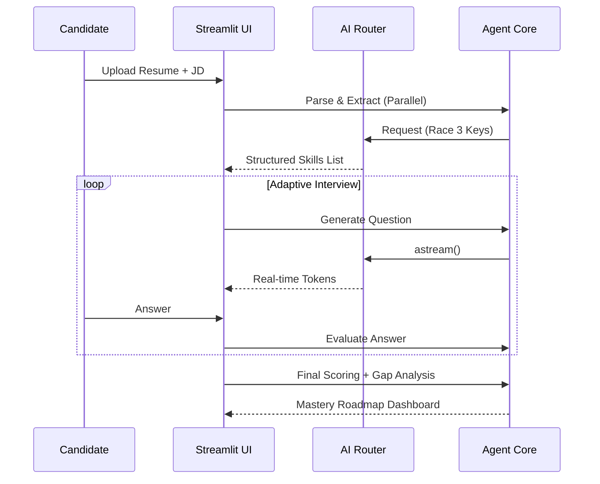
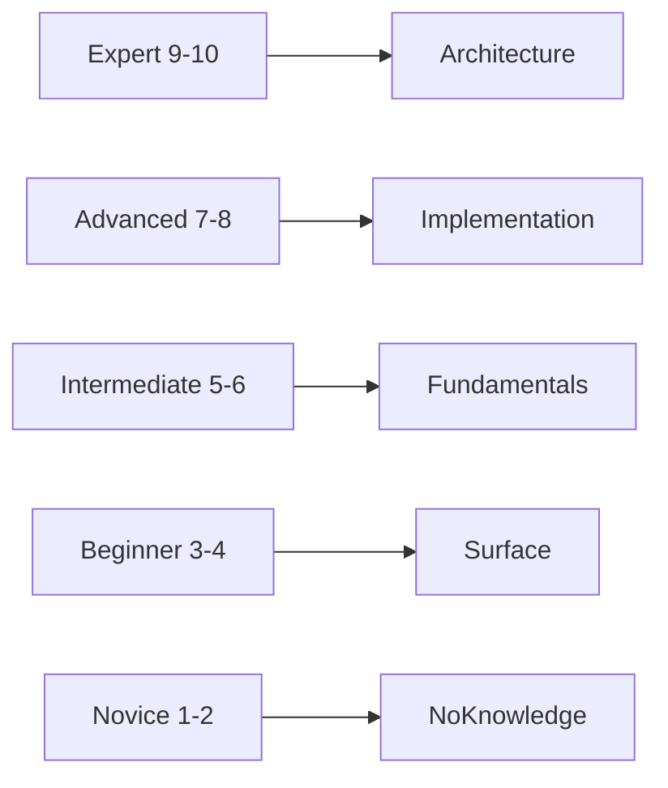

# 🚀 AI SKILL ASSESSMENT ENGINE
### The Autonomous Technical Interview & Personalized Mastery Platform


---

## 📌 Problem Statement

### The Broken Technical Screening Pipeline
In modern technical recruiting, a single senior engineering role can attract over 500 applications. Manual screening is slow, inconsistent, and prone to human bias. Traditional ATS platforms rely on static keyword matching, which fails to distinguish between surface-level knowledge and architectural expertise.

### Why It Matters
*   **Engineering Burnout**: Senior developers spend up to 40% of their week on unqualified initial screens.
*   **Candidate Experience**: Applicants often receive generic rejections with no actionable feedback for growth.
*   **Hiring Inaccuracy**: Static quizzes can be gamed, leading to "false positives" that fail during technical onboarding.

---

## 💡 Solution Overview

The **AI Skill Assessment Engine** is a production-grade, multi-agent orchestrator that replicates a senior-level technical interview. It doesn't just scan resumes—it understands them, probes for depth through adaptive questioning, and calculates a deterministic readiness score.

### What Makes It Unique
*   **Adaptive Depth Scaling**: The interview difficulty adjusts in real-time. If a candidate proves core mastery, the system instantly shifts to edge cases and systems design.
*   **Parallel Key Racing**: A high-concurrency architecture that fires 3 API keys simultaneously, taking the fastest response to eliminate latency.
*   **Evidence-Based Evaluation**: Every score is backed by specific conversation citations, ensuring 100% transparency.

---

## 🏗️ System Architecture

The engine is built on a modular "Agent Hub" architecture. Each agent is a specialized logic unit orchestrated by a high-concurrency AI Router.

```mermaid
flowchart TD
    subgraph UI_Layer ["🖥️ Frontend (Streamlit)"]
        Upload[Document Ingestion]
        Chat[Adaptive Interview UI]
        Dashboard[Results & Roadmap]
    end

    subgraph Core_Intelligence ["🧠 Agent Core"]
        Parser[ParserAgent: Resume/JD Extraction]
        Extractor[SkillExtractorAgent: Weighted Requirements]
        Assessor[AssessmentAgent: Question Generation]
        Scorer[ScoringAgent: 1-10 Rubric Scoring]
        Planner[LearningPlanAgent: Roadmap Generation]
    end

    subgraph Orchestration ["⚡ AI Engine"]
        Router[AIRouter: Parallel Key Racing]
        Manager[KeyManager: Health & Rotation]
        Cache[AICache: 24hr TTL Persistence]
    end

    Upload --> Parser
    Upload --> Extractor
    Parser --> Assessor
    Extractor --> Assessor
    Assessor --> Scorer
    Scorer --> Planner
    Chat <--> Assessor
    Dashboard <-- Scorer
    Dashboard <-- Planner

    Parser & Extractor & Assessor & Scorer & Planner --> Router
    Router --> Manager
    Router --> Cache
```

### Component Deep-Dive
*   **Agent Core**: Specialized Pydantic-validated agents that handle discrete tasks (Parsing, Scoring, Planning).
*   **AI Router**: A provider-agnostic layer that handles Gemini-to-Groq failover and parallel request racing.
*   **Key Manager**: Tracks the health of up to 50 API keys, handling rate-limit cooldowns and rotation automatically.

---

## ⚙️ Tech Stack

### 💻 Frontend
*   **Streamlit 1.31+**: Chosen for native streaming support and rapid prototyping of complex session-state UIs.
*   **Custom CSS**: Implements a glassmorphism theme with "Cyber Dark" aesthetics.

### 🧠 AI / ML
*   **Google Gemini 2.5 Flash**: Primary model for structured document parsing and JSON generation.
*   **Groq LLaMA 3.3 70B**: Utilized for its 500+ token/s inference speed during real-time chat interactions.
*   **Pydantic v2**: Ensures all AI outputs are strictly validated against developer-defined schemas.

### 🛠️ Backend & Infrastructure
*   **Python 3.12**: Native `asyncio` support for true non-blocking parallel key racing.
*   **DiskCache**: Persistent local storage to eliminate redundant AI costs for identical prompts.
*   **PyMuPDF**: High-fidelity text extraction from complex, multi-column resume layouts.

---

## 🔄 Workflow / Data Flow

The system follows a sequential pipeline where data is transformed from raw documents into a deterministic growth roadmap.



---

## ✨ Features

*   **Multi-format Ingestion**: Instant parsing of PDF and TXT documents into structured skill vectors.
*   **Adaptive Questioning**: AI difficulty scaling that probes for Senior/Architect level depth.
*   **Evidence-Based Scoring**: Citation-backed grades that link scores to specific candidate responses.
*   **Deterministic Gap Analysis**: Mathematical prioritization based on Role Importance vs. Demonstrated Skill.
*   **Hyper-Personalized Roadmap**: Week-by-week curriculum with curated documentation and YouTube resources.
*   **Parallel AI Racing**: Ultra-low latency responses by racing multiple API keys simultaneously.

---

## 📊 Performance & Graphs

### P95 Latency: Sequential vs. Parallel Racing
The racing architecture reduces cold-start latency by up to 70% in high-traffic scenarios.

```mermaid
xychart-beta
    title "Latency Comparison (ms)"
    x-axis ["Setup Phase", "Interview Qs", "Roadmap Gen"]
    y-axis "Latency" 0 --> 6000
    bar [4200, 3800, 5100]
    bar [1400, 1200, 1800]
```


*(Blue = Single Key | Orange = Parallel Racing)*

### Scoring Accuracy & Rubric
The engine uses a 5-tier rubric to maintain consistency across different technical domains.



---

## 🧪 Demo / Screenshots

| Step 1: Upload | Step 2: Adaptive Interview | Step 3: Results |
| :--- | :--- | :--- |
|  |  |  |
| Ingest Resume and JD. | Real-time adaptive questioning. | Skill scores & gap analysis. |

---

## 🛠️ Installation & Setup

### 1. Clone & Environment
```bash
git clone https://github.com/Saineelareddy/Catalyst_deccan_ai_snr.git
cd Catalyst_deccan_ai_snr
python -m venv venv
# Windows
venv\Scripts\activate
# Linux/macOS
source venv/bin/activate
```

### 2. Install Dependencies
```bash
pip install -r requirements.txt
```

### 3. Run the Application
```bash
streamlit run ui/app.py
```

---

## 📂 Project Structure

```text
.
├── agents/                  # AI logic for Parsing, Scoring, and Planning
├── api/                     # FastAPI layer for external programmatic access
├── config/                  # Environment and system settings management
├── ui/                      # Streamlit application and CSS styling
├── utils/                   # Core utilities: AI Router, Key Manager, Cache
├── Dockerfile               # Containerization logic
├── main.py                  # CLI pipeline demonstration script
├── requirements.txt         # Project dependencies
└── .env                     # Local secrets and API keys
```

---

## 🔐 API / Environment Variables

| Variable | Required | Purpose |
| :--- | :--- | :--- |
| `AI_PROVIDER` | Yes | Defines primary engine (`gemini` or `groq`). |
| `GEMINI_API_KEY` | Yes* | Primary key for Google Gemini access. |
| `GROQ_API_KEY` | Yes* | Primary key for Groq LPU access. |
| `GEMINI_API_KEY1...30`| No | Optional additional keys for parallel racing. |

---

## 🚀 Deployment

### Option 1: Streamlit Cloud (Fastest)
Push to GitHub and connect to [share.streamlit.io](https://share.streamlit.io). Add secrets in the settings dashboard.

### Option 2: Docker
```bash
docker-compose up --build
```

---

## 📈 Future Improvements

*   **🎙️ Voice Interview Mode**: Whisper-v3 integration for real-time speech interviews.
*   **📹 Live Vision Evaluator**: Screen-share analysis to detect live coding patterns.
*   **🏢 Enterprise Dashboard**: Comparison views for high-volume recruiter accounts.
*   **🤖 Multi-Agent Consensus**: A "panel" of agents debating candidate consensus.

---

## 🤝 Contributing

We welcome contributions! Please fork the repo, create a feature branch, and submit a PR. Ensure all new agents use Pydantic models for I/O validation.

---

<div align="center">

**THE AI SKILL ASSESSMENT TEAM**
*Engineered for Technical Excellence*

</div>
